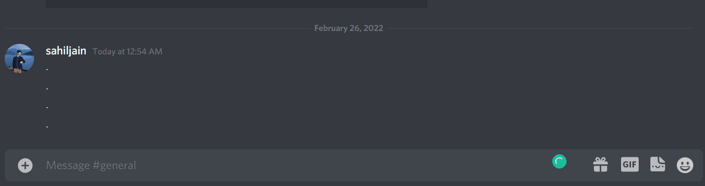

<!-- PROJECT LOGO -->
 

  

<h3 align="center">Discord Bot Stock Info</h3>
 

## About The Project

**Overview:** This bot will provide information about the NSE stock market. 

* The bot will provide information about price of a particular stock in real time. - $price SYMBOL
* The bot will provide everything about the stock including the relevant ratios, market cap, ebitda, volume, etc. - $info SYMBOL  
* The bot will also provide all the stocks that are currently at their 52 week low. - $52weeklow

## Joining The Discord channel

Discord invite link: https://discord.gg/7N4syb6Nfr

